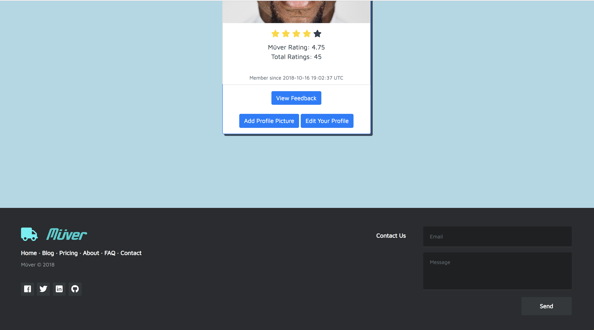

# Muver

*Find help or help others move*

>This application was the winning application for Wyncode's Pitch Night on October 18th, 2018.

The entire application was created within two weeks.

## Features
* **Interactive maps** where you can find and search for people who need help moving.
* **Live chat** capabilities to communicate with other users.
* **Notifications** for users when a proposal has been created on their listing.

### Technologies Used
* React.js
* Ruby
* Rails
* Amazon Web Services
* Bootstrap
* mapbox
* HTML, CSS, JS
* Devise

Home             |  After Sign In
:-------------------------:|:-------------------------:
 |  

Listings Index             | Listings Show
:-------------------------:|:-------------------------:
 |  

Profile Show              | Footer
:-------------------------:|:-------------------------:
 |  
